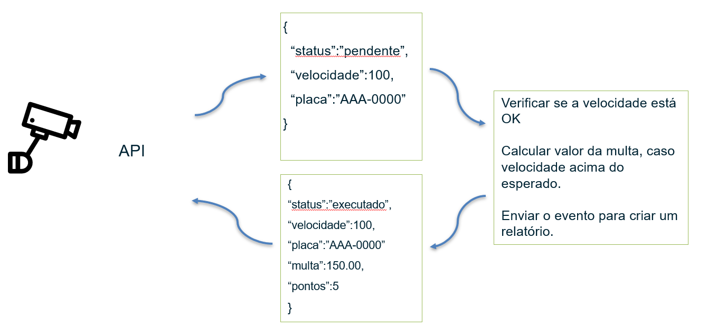

# Projeto sensor radar

### Objetivo
Este projeto refere-se à uma pequena aplicação usando o Kafka Streams e Clojure com objetivo da utilização no aprendizado.

### Descrição
Neste momento do projeto, a idéia é enviar um comando (mensagem) em um tópico de entrada no kafka e seguindo uma lógica esse comando é encaminhado para outros tópicos que vai fazer a leitura dos dados e definir se deve ou não aplicar uma multa naquele comando que chegou. O comando representa uma leitura de um radar de velocidade que contem a placa do veiculo e a velocidade.



### Para rodar o projeto (docker compose)

Para subir a aplicação usar o comando do docker compose.

```
docker compose up
```
Em outra aba entrar no container do kafka e enviar a mensagem no tópico de entrada


```
docker exec -it kafka bash
```
```
kafka-console-producer.sh --bootstrap-server localhost:9092 --property "parse.key=true" --property "key.separator=:" --topic comando.radar
```
```
001:{"status": "pendente", "velocidade": 101, "placa": "AAA-0001"}
```
Observar o log gerado na janela do projeto, além disso um arquivo relatorio.txt sera criado com a saída do comando (quando houver uma multa aplicada)

### Para rodar o projeto (kubernetes)

Para subir o projeto usando kubernetes usar o comando

```
kubectl apply -f kubernetes\
```

Aguardar até que os pods sejam criados e se estabilizam. Podemos acompanhar com o conmando:

```
kubectl get pods
```
Com o comando acima, vamos observar o nome que foi gerado para os pods.

Para o nosso teste, vamos abrir um terminal novo e deixar os logs do backend rodando para vizualizar assim que for enviado uma mensagem.

```
kubectl logs <nome-pod-backend> -f
```

Agora podemos entrar no pod do kafka para enviar uma mensagem no producer do kafka.

```
kubectl exec -it <nome-pod-kafka> -- bash

```
```
kafka-console-producer.sh --bootstrap-server kafka:9092 --property "parse.key=true" --property "key.separator=:" --topic comando.radar
```

```
001:{"status": "pendente", "velocidade": 101, "placa": "AAA-0000"}
```

Para finalizar, vamos observar o txt que foi criado. Para isso vamos entrar no pod do backend e localizar nosso relatorio.txt

```
kubectl exec -it <nome-pod-backend> -- bash
```

```
cat relatorio.txt
```

### cmds úteis
```cria um tópico ```
```
kafka-topics.sh --create --bootstrap-server localhost:9092 --topic <nome-do-topico>
```

 ```para enviar uma mensagem ao tópico```
 ```
 kafka-console-producer.sh --bootstrap-server localhost:9092 --property "parse.key=true" --property "key.separator=:" --topic <nome-do-topico>
 ```
```imprimir todas mensagens de um tópico```
```
kafka-console-consumer.sh --bootstrap-server localhost:9092 --topic comando.radar --isolation-level read_committed --property "print.timestamp=true" --property "print.key=true" --property key.separator=" :
" --timeout-ms 10000 --from-beginning
```
```deletar um tópico```
```
kafka-topics.sh --bootstrap-server localhost:9092 --delete --topic comando.radar
```
